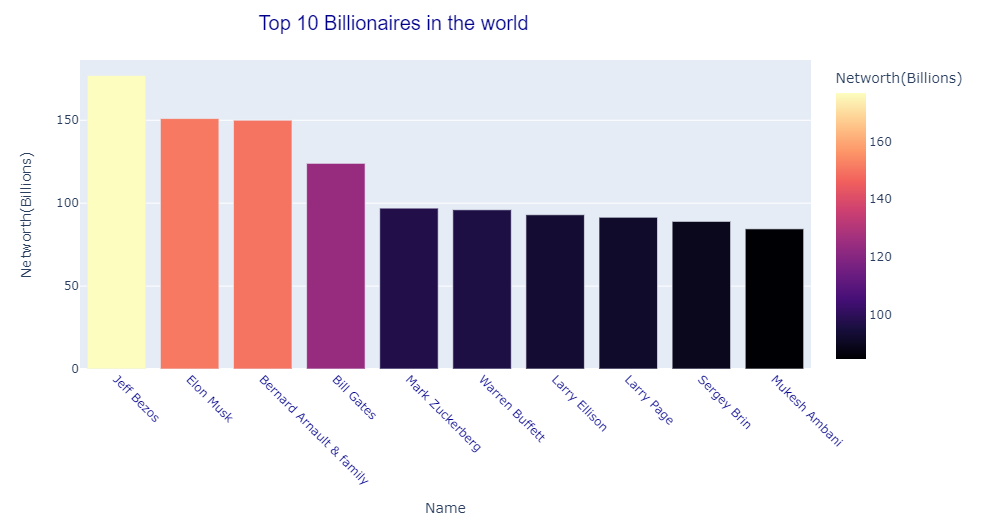
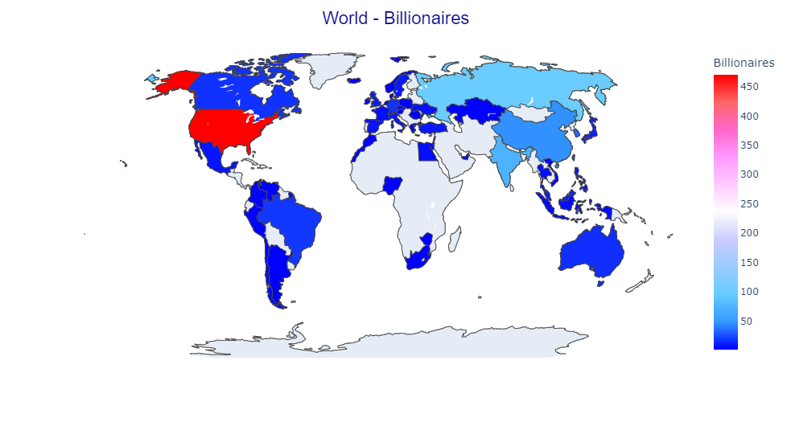
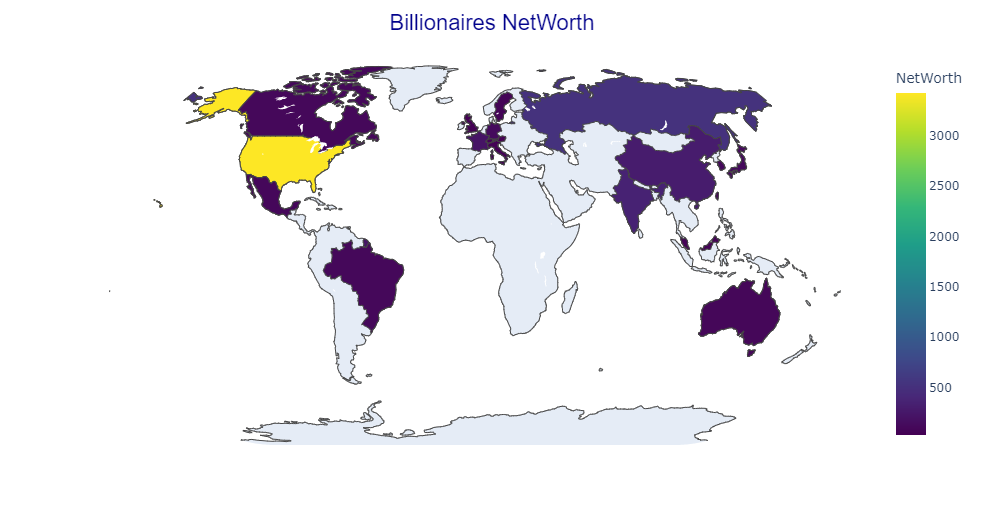
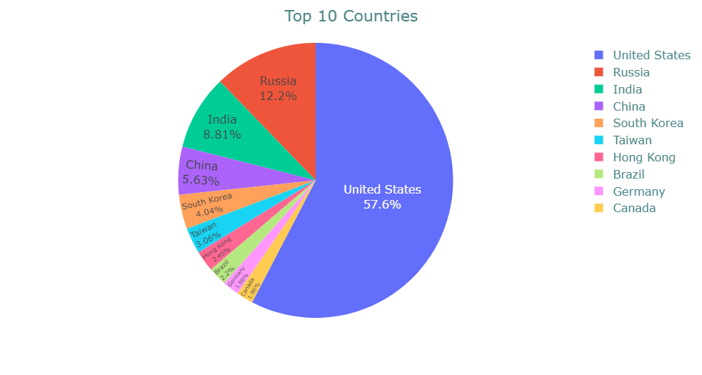
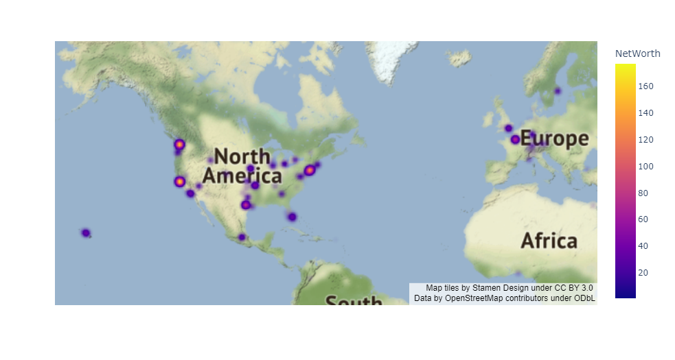
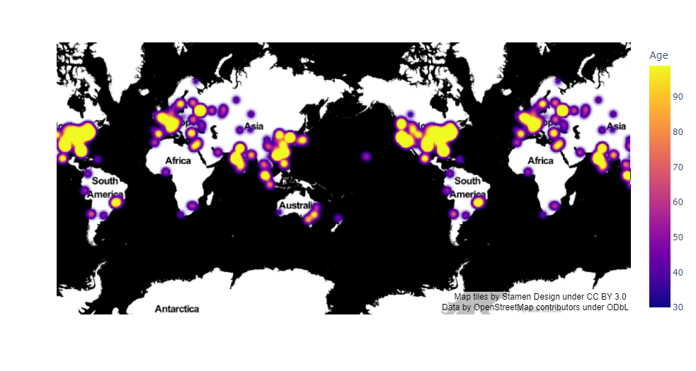

# MONU-Project2-Billionaires
MONU Bootcamp Project 2 Billionaires  

### Billionaires mapping (DC)

Maps generated by using Plotly in Jupyter Notebook Pandas code  

  

 

 

 

 

 

Maps generated by using Leaflet Javascript Library 

 

 

 

